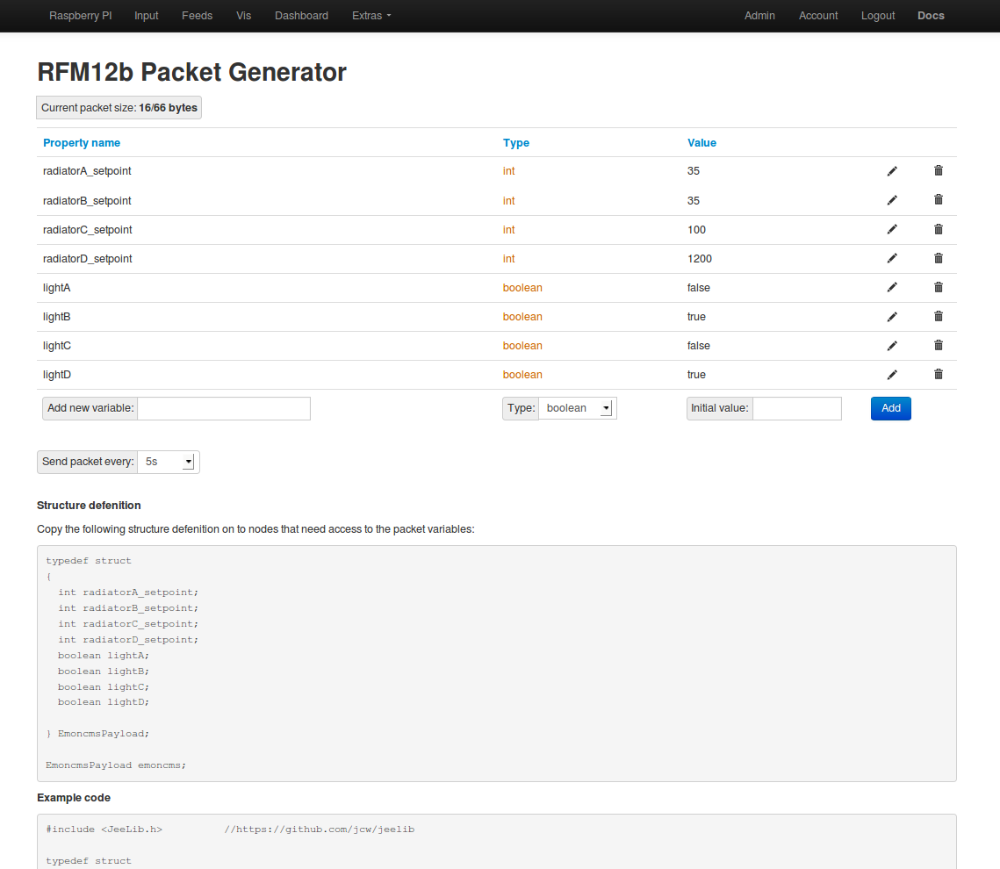

# RFM12b Packet Generator

## Archive Module 

This module is no longer under development or support 

Recommend using MQTT, nodeRED, openHAB and Wifi control relay  to inform control systems and activate control. These are all built into the [latest Raspberry Pi Emoncms SD card image](https://github.com/openenergymonitor/emonpi/wiki/emonSD-pre-built-SD-card-Download-%26-Change-Log).

[Integrations User Guide](https://guide.openenergymonitor.org/integrations/)

*** 

Create RFM12b struct format rfm12b data packets in emoncms to be broadcast from a rfm12pi or jeelink connected to a computer or raspberrypi running emoncms. A first attempt / concept of what could be the foundations for control features in emoncms to do things like set radiator set point temperatures and so on.
 
This module works in conjunction with the raspberrypi emoncms module.

If your interested in control and would like to help extending this, maybe integrating buttons and sliders into emoncms dashboards which could then write to the packet generator, help would be most appreciated.

Licence: GPL GNU
Author: Trystan Lea

## API

### Updating a variable

To update a single variable in a packet use the following URL, with properties: **id** for the variable id in the packet (starts at 0), and **value** for the value you wish to assign

    http://localhost/emoncms/packetgen/update.json?id=4&value=33
    
Add the write apikey at the end with &apikey=xxxxxxxxx for external authentication.

